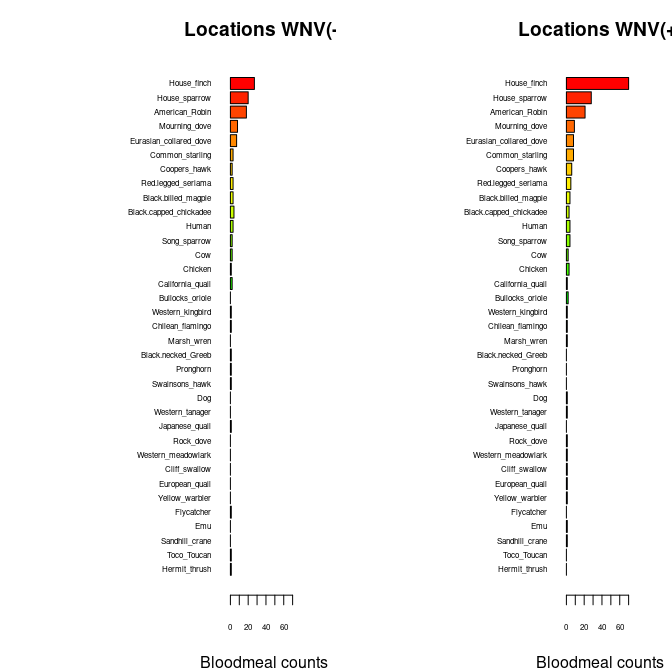

Warm-up mini-Report: Mosquito Blood Hosts in Salt Lake City, Utah
================
Kylie Peasley
2025-11-06

- [ABSTRACT](#abstract)
- [BACKGROUND](#background)
- [STUDY QUESTION and HYPOTHESIS](#study-question-and-hypothesis)
  - [Questions](#questions)
  - [Hypothesis](#hypothesis)
  - [Prediction](#prediction)
- [METHODS](#methods)
- [DISCUSSION](#discussion)
  - [Interpretation of 1st analysis
    (barplots)](#interpretation-of-1st-analysis-barplots)
  - [Interpretation of 2nd analysis (generalized linear
    model)](#interpretation-of-2nd-analysis-generalized-linear-model)
- [CONCLUSION](#conclusion)
- [REFERENCES](#references)

# ABSTRACT

This report investigates the transmission of West Nile Virus through
birds and mosquitoes in Salt Lake City and whether House Finches are a
key amplifying species. Previously, an experimental infection study had
identified several species of birds, including House Finches, as being
better amplifying hosts than others due to their ability to develop high
viremia levels. Komar et al. (2003). To determine the relationship
between House Finches and mosquitos in the transmission of WNV, blood
meal data from WNV positive and negative locations was analyzed using
linear regression tests. Overall, the results support the hypothesis
that House Finches are key amplifiers of WNV transmission due to both
their ability to develop higher viremia levels than other species and
the finding that House Finches are a common blood meal for mosquitoes in
WNV positive areas.

# BACKGROUND

West Nile Virus (WNV) is a mosquito-borne disease maintained by a
transmission cycle between birds and mosquitoes, and can spread to
humans and other animals by a bite from an infected mosquito. Mosquitoes
can infect and become infected by a bird by feeding on their blood.
Previous research has shown that birds have varying viremia duration and
some species have longer duration than others, thus acting as amplifying
hosts for the virus (Komar et al.,2003).

To identify hosts, the extracted DNA is amplified using polymerase chain
reaction (PCR) and then sequenced, allowing scientists to match the
resulting genetic sequences to known species sequences in reference
databases. Based on this, samples taken from mosquitoes in Salt Lake
City in high transmission and WNV positive areas should have more House
Finch bloodmeals than other species in that area.

``` r
# Manually transcribe duration (mean, lo, hi) from the last table column
duration <- data.frame(
  Bird = c("Canada Goose","Mallard", 
           "American Kestrel","Northern Bobwhite",
           "Japanese Quail","Ring-necked Pheasant",
           "American Coot","Killdeer",
           "Ring-billed Gull","Mourning Dove",
           "Rock Dove","Monk Parakeet",
           "Budgerigar","Great Horned Owl",
           "Northern Flicker","Blue Jay",
           "Black-billed Magpie","American Crow",
           "Fish Crow","American Robin",
           "European Starling","Red-winged Blackbird",
           "Common Grackle","House Finch","House Sparrow"),
  mean = c(4.0,4.0,4.5,4.0,1.3,3.7,4.0,4.5,5.5,3.7,3.2,2.7,1.7,6.0,4.0,
           4.0,5.0,3.8,5.0,4.5,3.2,3.0,3.3,6.0,4.5),
  lo   = c(3,4,4,3,0,3,4,4,4,3,3,1,0,6,3,
           3,5,3,4,4,3,3,3,5,2),
  hi   = c(5,4,5,5,4,4,4,5,7,4,4,4,4,6,5,
           5,5,5,7,5,4,3,4,7,6)
)

# Choose some colors
cols <- c(rainbow(30)[c(10:29,1:5)])  # rainbow colors

# horizontal barplot
par(mar=c(5,12,2,2))  # wider left margin for names
bp <- barplot(duration$mean, horiz=TRUE, names.arg=duration$Bird,
              las=1, col=cols, xlab="Days of detectable viremia", xlim=c(0,7))

# add error bars
arrows(duration$lo, bp, duration$hi, bp,
       angle=90, code=3, length=0.05, col="black", xpd=TRUE)
```


``` r
## import counts_matrix: data.frame with column 'loc_positives' (0/1) and host columns 'host_*'
counts_matrix <- read.csv("./bloodmeal_plusWNV_for_BIOL3070.csv")

## 1) Identify host columns
host_cols <- grep("^host_", names(counts_matrix), value = TRUE)

if (length(host_cols) == 0) {
  stop("No columns matching '^host_' were found in counts_matrix.")
}

## 2) Ensure loc_positives is present and has both levels 0 and 1 where possible
counts_matrix$loc_positives <- factor(counts_matrix$loc_positives, levels = c(0, 1))

## 3) Aggregate host counts by loc_positives
agg <- stats::aggregate(
  counts_matrix[, host_cols, drop = FALSE],
  by = list(loc_positives = counts_matrix$loc_positives),
  FUN = function(x) sum(as.numeric(x), na.rm = TRUE)
)

## make sure both rows exist; if one is missing, add a zero row
need_levels <- setdiff(levels(counts_matrix$loc_positives), as.character(agg$loc_positives))
if (length(need_levels)) {
  zero_row <- as.list(rep(0, length(host_cols)))
  names(zero_row) <- host_cols
  for (lv in need_levels) {
    agg <- rbind(agg, c(lv, zero_row))
  }
  ## restore proper type
  agg$loc_positives <- factor(agg$loc_positives, levels = c("0","1"))
  ## coerce numeric host cols (they may have become character after rbind)
  for (hc in host_cols) agg[[hc]] <- as.numeric(agg[[hc]])
  agg <- agg[order(agg$loc_positives), , drop = FALSE]
}

## 4) Decide species order (overall abundance, descending)
overall <- colSums(agg[, host_cols, drop = FALSE], na.rm = TRUE)
host_order <- names(sort(overall, decreasing = TRUE))
species_labels <- rev(sub("^host_", "", host_order))  # nicer labels

## 5) Build count vectors for each panel in the SAME order
counts0 <- rev(as.numeric(agg[agg$loc_positives == 0, host_order, drop = TRUE]))
counts1 <- rev(as.numeric(agg[agg$loc_positives == 1, host_order, drop = TRUE]))

## 6) Colors: reuse your existing 'cols' if it exists and is long enough; otherwise generate
if (exists("cols") && length(cols) >= length(host_order)) {
  species_colors <- setNames(cols[seq_along(host_order)], species_labels)
} else {
  species_colors <- setNames(rainbow(length(host_order) + 10)[seq_along(host_order)], species_labels)
}

## 7) Shared x-limit for comparability
xmax <- max(c(counts0, counts1), na.rm = TRUE)
xmax <- if (is.finite(xmax)) xmax else 1
xlim_use <- c(0, xmax * 1.08)

## 8) Plot: two horizontal barplots with identical order and colors
op <- par(mfrow = c(1, 2),
          mar = c(4, 12, 3, 2),  # big left margin for species names
          xaxs = "i")           # a bit tighter axis padding

## Panel A: No WNV detected (loc_positives = 0)
barplot(height = counts0,
        names.arg = species_labels, 
        cex.names = .5,
        cex.axis = .5,
        col = rev(unname(species_colors[species_labels])),
        horiz = TRUE,
        las = 1,
        xlab = "Bloodmeal counts",
        main = "Locations WNV(-)",
        xlim = xlim_use)

## Panel B: WNV detected (loc_positives = 1)
barplot(height = counts1,
        names.arg = species_labels, 
        cex.names = .5,
        cex.axis = .5,
        col = rev(unname(species_colors[species_labels])),
        horiz = TRUE,
        las = 1,
        xlab = "Bloodmeal counts",
        main = "Locations WNV(+)",
        xlim = xlim_use)
```



``` r
par(op)

## Keep the colors mapping for reuse elsewhere
host_species_colors <- species_colors
```

# STUDY QUESTION and HYPOTHESIS

## Questions

How important are House Finches in the transmission cycle of West Nile
Virus in Salt Lake City, Utah?

## Hypothesis

Certain bird species, specifically House Finches, are more likely to a
source of blood meals for mosquitoes compared to other bird species,
making them a key amplifying host for WNV transmission in Salt Lake
City.

## Prediction

If House Finches are key amplifying hosts of West Nile Virus in Salt
Lake City, then they will exhibit higher counts of mosquito blood meals
in WNV-positive areas than other species. Additionally, areas in Salt
Lake City where mosquitoes frequently feed on House Finches will have
higher numbers of WNV-positive mosquitos than areas where House Finches
are a less common source of bloodmeals.

# METHODS

Mosquito samples were collected from various areas in Salt Lake City and
the sites they came from were categorized into either WNV-positive or
WNV-negative based on if WNV was detected in the sample. Only the
mosquitoes with blood meal samples were used for data collection. DNA
was extracted from the bloodmeals and amplified by Polymerase Chain
Reaction (PCR) and then sequenced. The DNA sequence results were then
cross referenced with known species sequences in a database to determine
the host species for each blood meal.

The number of mosquito bloodmeals from each host species was compared
between WNV-negative sites and WNV-positive sites using a barplot for
ease of visualization. Barplots are helpful to compare categories, in
this case being the count of bloodmeals from different bird species
within areas of WNV transmission.

\##1st analysis (barplots)

The bars represent the amount of mosquito blood meals from each bird
species and indicate whether they came from for ease of comparison
between the WNV-positive and WNV-negative sites. Barplots summarize the
data in a way that makes it easier to see which species were more common
in WNV-positive areas. It helps to visualize patterns that may not have
been easily identified in the raw data.

\##2nd analysis (generalized linear model)

The generalized linear model was used to formally evaluate the
relationship between House Finch blood meals and WNV-positive areas, as
suggested by the barplot analysis. The binary method was used to test if
the likelihood of a site being WNV-positive was related to the number of
House Finch blood meals. The numeric method was used to test whether
WNV-positive sites tended to have higher numbers of House Finch blood
meals compared to WNV-negative sites.

``` r
# second-analysis-or-plot, glm with house finch alone against binary +/_
glm1 <- glm(loc_positives ~ host_House_finch,
            data = counts_matrix,
            family = binomial)
summary(glm1)
```

    ## 
    ## Call:
    ## glm(formula = loc_positives ~ host_House_finch, family = binomial, 
    ##     data = counts_matrix)
    ## 
    ## Coefficients:
    ##                  Estimate Std. Error z value Pr(>|z|)  
    ## (Intercept)       -0.1709     0.1053  -1.622   0.1047  
    ## host_House_finch   0.3468     0.1586   2.187   0.0287 *
    ## ---
    ## Signif. codes:  0 '***' 0.001 '**' 0.01 '*' 0.05 '.' 0.1 ' ' 1
    ## 
    ## (Dispersion parameter for binomial family taken to be 1)
    ## 
    ##     Null deviance: 546.67  on 394  degrees of freedom
    ## Residual deviance: 539.69  on 393  degrees of freedom
    ## AIC: 543.69
    ## 
    ## Number of Fisher Scoring iterations: 4

``` r
#glm with house-finch alone against positivity rate
glm2 <- glm(loc_rate ~ host_House_finch,
            data = counts_matrix)
summary(glm2)
```

    ## 
    ## Call:
    ## glm(formula = loc_rate ~ host_House_finch, data = counts_matrix)
    ## 
    ## Coefficients:
    ##                  Estimate Std. Error t value Pr(>|t|)    
    ## (Intercept)      0.054861   0.006755   8.122 6.07e-15 ***
    ## host_House_finch 0.027479   0.006662   4.125 4.54e-05 ***
    ## ---
    ## Signif. codes:  0 '***' 0.001 '**' 0.01 '*' 0.05 '.' 0.1 ' ' 1
    ## 
    ## (Dispersion parameter for gaussian family taken to be 0.01689032)
    ## 
    ##     Null deviance: 6.8915  on 392  degrees of freedom
    ## Residual deviance: 6.6041  on 391  degrees of freedom
    ##   (2 observations deleted due to missingness)
    ## AIC: -484.56
    ## 
    ## Number of Fisher Scoring iterations: 2

# DISCUSSION

Both the barplot and generalized linear model analyses supported the
hypothesis that House Finches act as important amplifying hosts in
WNV-transmission in Salt Lake City. The bar plots showed that House
Finch blood meals were more common in sites classified as WNV-positive
than in WNV-negative sites. The binary model supported this as well,
with a p-value of 0.0287. The p-value indicates a very significant
relationship between the two variables, showing that areas with higher
numbers of mosquito House Finch blood meals are more likely to be
WNV-positive sites. The numeric model showed that higher counts of House
Finch blood meals tended to have higher WNV-positivity rates.

All of the analyses support the hypothesis, but there are some
limitations to this research. The results may have been influenced by
the time of year the results were collected, especially considering the
seasonal differences in Utah. The samples were also only collected in
one area. Although the area is somewhat large, this factor limits how
applicable the results are for other areas. Lastly, House Finches are
very common in Salt Lake, so them having high numbers of mosquito blood
meals may be due to their relative abundance.

## Interpretation of 1st analysis (barplots)

The barplot analysis suggested that mosquito blood meals from House
Finches were more common in WNV-positive areas than in WNV-negative
areas. The visual trend shown by the bar plots supports the hypothesis
that House Finches play an important role as an amplifying host in WNV
transmission in Salt Lake City. In contrast with House Finches, other
bird species had less mosquito blood meal counts in WNV-negative areas,
further suggesting that they do not play a role as an amplifying host in
WNV transmission.

## Interpretation of 2nd analysis (generalized linear model)

The generalized linear model indicated a significant positive
relationship between the number of House Finch blood meals and
WNV-positive sites. The p-value of 0.0287 tells us the relationship
between the House Finch blood meals and whether a site was WNV-positive
and that it is highly unlikely that it was due to random chance. The
non-negative p-value also shows a positive relationship between the
number of House Finch blood meals and WNV-positivity, meaning that as
one increases, so does the other.The binary model tested the likelihood
of WNV-positive and WNV-negative areas having more House Finch blood
meals. The numeric model tested whether sites with higher numbers of
House Finch blood meals have a higher rate of WNV-transmission. The
results of the generalized linear model supported the hypothesis.

# CONCLUSION

Overall, the results and the analysis of the data support the hypothesis
that House Finches act as key amplifying hosts for West Nile Virus
transmission in Salt Lake City, Utah. The data analyses suggest that
areas with higher numbers of House Finches may have a higher likelihood
of being a site of high transmission of West Nile Virus. To strengthen
this study, future research should include varying seasonal collection,
additional species of birds, and sample collection from broader areas.
This could determine if House Finches are amplifying hosts in other
areas besides Salt Lake City.

# REFERENCES

1.  Komar N, Langevin S, Hinten S, Nemeth N, Edwards E, Hettler D, Davis
    B, Bowen R, Bunning M. Experimental infection of North American
    birds with the New York 1999 strain of West Nile virus. Emerg Infect
    Dis. 2003 Mar;9(3):311-22. <https://doi.org/10.3201/eid0903.020628>

2.  ChatGPT. OpenAI, version Jan 2025. Used as a reference for functions
    such as plot() and to correct syntax errors. Accessed 2025-11-06.
